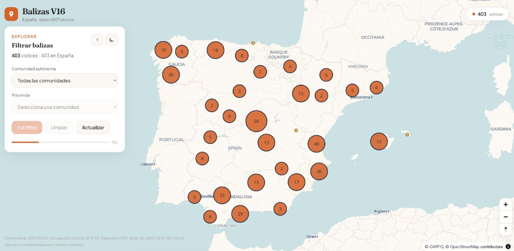

# Balizas V16 España

Real-time interactive map of active V16 emergency beacons across Spain, powered by official DGT (Spanish Traffic Authority) DATEX2 data.



## Overview

This side project visualizes live vehicle obstruction incidents reported through Spain's V16 connected beacon system. The app fetches official DATEX2 XML from the DGT National Access Point, parses and filters relevant incidents, and renders them on an interactive MapLibre GL map with clustering, geographic filters, and detailed popups on click.

## Features

- **Live map** — WebGL map centered on Spain with cluster aggregation at low zoom and individual beacon points at high zoom
- **Official data** — DATEX2 v3.7 feed from `nap.dgt.es`, refreshed every 60 seconds
- **Geographic filters** — Filter by autonomous community and province, with fit-to-bounds navigation
- **Beacon details** — Click any point to see location, road, kilometer point, activation time, cause, severity, lane impact, delays, and more
- **Collapsible filter panel** — Hamburger menu to maximize map space after applying filters
- **Light / dark theme** — Toggle with preference persisted in `localStorage`
- **Auto-refresh** — Background polling with countdown indicator and manual refresh option

## Tech Stack

| Layer | Technology |
|-------|------------|
| Framework | [Next.js 15](https://nextjs.org/) (App Router) |
| UI | [React 19](https://react.dev/) + [TypeScript](https://www.typescriptlang.org/) |
| Map | [MapLibre GL JS 5](https://maplibre.org/) |
| Styling | [Tailwind CSS v4](https://tailwindcss.com/) |
| Basemap | CARTO Voyager / Dark Matter |
| Fonts | Fraunces + Plus Jakarta Sans (Google Fonts) |

## Architecture

```
DGT DATEX2 XML
      │
      ▼
parse-datex2.ts  ──►  V16Beacon[]  (typed, filtered)
      │
      ├──► Server Component (page.tsx) — initial SSR fetch, revalidate 60s
      │
      └──► GET /api/beacons  ──►  JSON API with cache headers
                │
                ▼
         useBeaconRefresh hook  ──►  client polling every 60s
                │
                ▼
         BeaconMap (dynamic, ssr: false)
                │
                ├── GeoJSON source + cluster layers
                ├── feature-state hover / selected
                └── React popups via createRoot()
```

### Key design decisions

- **Map loaded client-side only** — `next/dynamic` with `ssr: false` avoids MapLibre/WebGL hydration issues
- **Custom XML parser** — Lightweight regex-based DATEX2 parser without heavy XML dependencies
- **In-memory server cache** — 60s TTL on the DGT fetch to reduce upstream load
- **Clustering** — `clusterRadius: 50`, `clusterMaxZoom: 12` for performant rendering of 400+ points

## Getting Started

### Prerequisites

- Node.js 18+
- npm

### Install & run

```bash
npm install
npm run dev
```

Open [http://localhost:3000](http://localhost:3000).

### Production build

```bash
npm run build
npm start
```

## API

### `GET /api/beacons`

Returns all active V16 beacons as JSON.

**Response shape:**

```json
{
  "updatedAt": "2026-06-25T17:12:22.854Z",
  "publicationTime": "2026-06-25T19:10:50.693+02:00",
  "source": "DGT NAP DATEX2 v3.7",
  "total": 403,
  "beacons": [
    {
      "id": "v16-16872837",
      "lat": 37.664776,
      "lon": -5.328656,
      "road": "A-3150",
      "kilometerPoint": 8.52,
      "municipality": "Palma del Río",
      "province": "Córdoba",
      "autonomousCommunity": "Andalucía",
      "severity": "low",
      "startedAt": "2026-06-25T14:30:00+02:00"
    }
  ]
}
```

**Caching:** `Cache-Control: public, s-maxage=60, stale-while-revalidate=120`

## Project Structure

```
src/
├── app/
│   ├── api/beacons/route.ts   # JSON API endpoint
│   ├── layout.tsx             # Root layout + fonts
│   ├── page.tsx               # Server page (initial data fetch)
│   └── globals.css            # Theme variables + animations
├── components/
│   ├── BeaconMap.tsx          # MapLibre map + interactions
│   ├── BeaconMapClient.tsx    # Dynamic import wrapper + refresh hook
│   ├── BeaconFiltersPanel.tsx # Collapsible filter sidebar
│   └── BeaconTooltipCard.tsx  # Beacon detail popup
├── hooks/
│   ├── useBeaconRefresh.ts    # 60s polling + countdown
│   └── useMapTheme.ts         # Light/dark theme persistence
└── lib/
    ├── beacons/
    │   ├── parse-datex2.ts    # DGT XML parser
    │   ├── filters.ts         # Geographic filtering
    │   ├── format.ts          # Display formatters
    │   └── types.ts           # TypeScript interfaces
    └── map/
        ├── beacon-geojson.ts  # Beacon → GeoJSON conversion
        ├── beacon-layers.ts   # MapLibre layer sync
        └── constants.ts       # Map config + style URLs
```

## Data Source

Incident data is provided by the [DGT National Access Point](https://nap.dgt.es/) under the DATEX II standard. This project filters situations where `causeType` is `vehicleObstruction` or `obstruction`, which correspond to V16 beacon activations.

> **Disclaimer:** This is an unofficial visualization tool. Always refer to official DGT channels for traffic safety information.

## Scripts

| Command | Description |
|---------|-------------|
| `npm run dev` | Start development server |
| `npm run build` | Production build |
| `npm start` | Run production server |
| `npm run lint` | ESLint check |

## License

Private portfolio project. Map tiles © [CARTO](https://carto.com/) · © [OpenStreetMap](https://www.openstreetmap.org/copyright) contributors.
